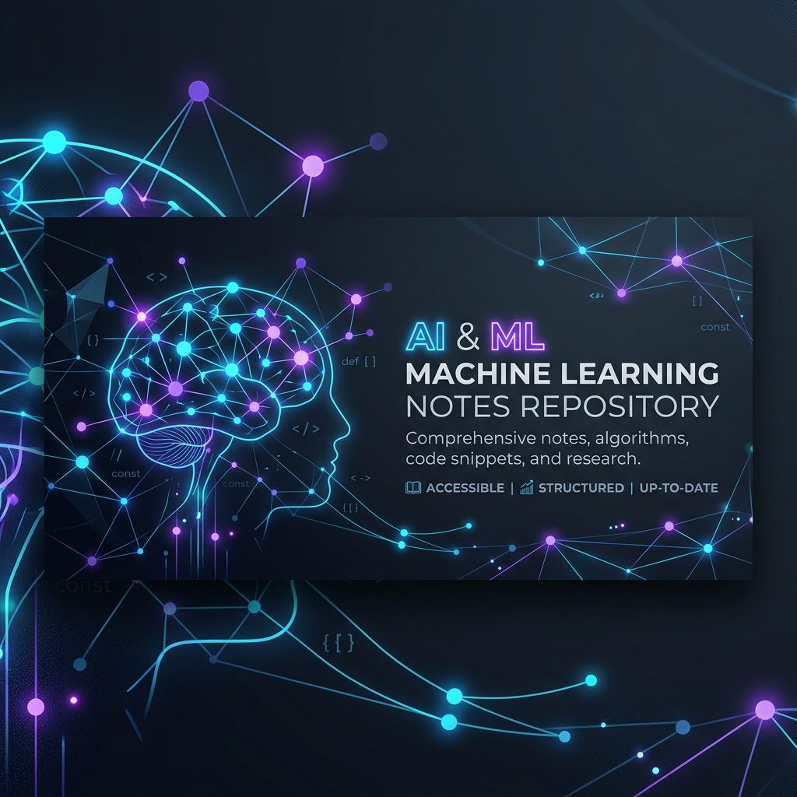

# 🤖 AI & Machine Learning Notes

Welcome to my personal AI & Machine Learning knowledge repository! This repository contains a structured compilation of lecture notes, consolidated sheets, labs, and study material covering everything from Python programming to advanced Deep Learning, LLMs, and MLOps.

---

## 📂 Table of Contents

### 📋 Course Overview & Consolidated Notes
*Weekly summaries, syllabus, project guidelines, and evaluation details.*
- [01 Consolidated Notes Week 1 - Sofi Altamsh - 26 J](masai/01%20Consolidated%20Notes%20Week%201%20-%20Sofi%20Altamsh%20-%2026%20J%2034386329dfd58119b604ff19ca857e42.md)
- [02 Consolidated Notes Week 2 - Sofi Altamsh - 2 Au](masai/02%20Consolidated%20Notes%20Week%202%20-%20Sofi%20Altamsh%20-%202%20Au%2034386329dfd581f8876ed58f24cb945e.md)
- [03 Consolidated Notes Week 3 - Sofi Altamsh - 9 Au](masai/03%20Consolidated%20Notes%20Week%203%20-%20Sofi%20Altamsh%20-%209%20Au%2034386329dfd581478b9be39ffa754384.md)
- [04 Consolidated Notes Week 3 (Extended) - Sofi Alt](masai/04%20Consolidated%20Notes%20Week%203%20%28Extended%29%20-%20Sofi%20Alt%2034386329dfd58183841cf6c8118c727d.md)
- [05 Consolidated notes Week 5 - Aashik Arun Bobade](masai/05%20Consolidated%20notes%20Week%205%20-%20Aashik%20Arun%20Bobade%20%2034386329dfd581f6b1c8f8c036f7b313.md)
- [06 Consolidated notes Week 4 - Aashik Arun Bobade](masai/06%20Consolidated%20notes%20Week%204%20-%20Aashik%20Arun%20Bobade%20%2034386329dfd5814ab274e46b2bccbce7.md)
- [07 Consolidated notes Week 6 - Aashik Arun Bobade](masai/07%20Consolidated%20notes%20Week%206%20-%20Aashik%20Arun%20Bobade%20%2034386329dfd581aa974ffe48dcb6f0f1.md)
- [08 Editorial Mid Trimester Evaluation (Attempt 2)](masai/08%20Editorial%20Mid%20Trimester%20Evaluation%20%28Attempt%202%29%20%2034486329dfd58178894af356f021122d.md)
- [09 AIML 2506 Entire course syllabus - Chandan B K](masai/09%20AIML%202506%20Entire%20course%20syllabus%20-%20Chandan%20B%20K%20%2034386329dfd581488391f75a10cd1da0.md)
- [49 Project Guidelines - IITP-AIML-2506 - Chandan B](masai/49%20Project%20Guidelines%20-%20IITP-AIML-2506%20-%20Chandan%20B%2034386329dfd581199dfdf29555b03ee4.md)
- [68 Tutorial Session Doc - Suman - 18 Apr 2026](masai/68%20Tutorial%20Session%20Doc%20-%20Suman%20-%2018%20Apr%202026%2037c86329dfd581c1be15fa632e0ac999.md)
- [88 Tutorial Session - 1 - Suman - 3 Jun 2026](masai/88%20Tutorial%20Session%20-%201%20-%20Suman%20-%203%20Jun%202026%2037c86329dfd581529746d523ef119cb5.md)

### 🐍 Foundational Python & Math
*Core programming concepts, variables, loops, data structures, and operators.*
- [45 Workshop Session Notes Variables and Data Types](masai/45%20Workshop%20Session%20Notes%20Variables%20and%20Data%20Types%2034486329dfd5815993e0dbccee4aed05.md)
- [48 Workshop Session Notes Operators and Expression](masai/48%20Workshop%20Session%20Notes%20Operators%20and%20Expression%2034486329dfd5819782b7fc289a4d6f3e.md)
- [79 Lecture Note Python Foundations, Variables and](masai/79%20Lecture%20Note%20Python%20Foundations%2C%20Variables%20and%20%2037c86329dfd58100b29ff7415af7421b.md)
- [84 Expressions, Operators, and Conditions - Nishut](masai/84%20Expressions%2C%20Operators%2C%20and%20Conditions%20-%20Nishut%2037c86329dfd5815eaf6bc2b05f54f2b5.md)
- [87 Lecture Note Loops And Repeated Processing - Ni](masai/87%20Lecture%20Note%20Loops%20And%20Repeated%20Processing%20-%20Ni%2037c86329dfd581e2adfac3d5c3b69ea9.md)
- [91 Python Data Structures Lists and Dictionaries -](masai/91%20Python%20Data%20Structures%20Lists%20and%20Dictionaries%20-%2037c86329dfd58125ae4ec1326b2726ee.md)

### 📈 Classical Machine Learning
*Supervised & unsupervised learning algorithms, regression, decision trees, ensembles, and reinforcement learning.*
- [13 Lecture Notes - Multiple & Polynomial Regressio](masai/13%20Lecture%20Notes%20-%20Multiple%20%26%20Polynomial%20Regressio%2034486329dfd581b6b9c8ffc3b2795a99.md)
- [14 Lecture notes - Regression in Business - Varun](masai/14%20Lecture%20notes%20-%20Regression%20in%20Business%20-%20Varun%20%2034386329dfd5810a97f9e07451586f76.md)
- [15 Lecture Notes - Regularisation Preview - Varun](masai/15%20Lecture%20Notes%20-%20Regularisation%20Preview%20-%20Varun%20%2034486329dfd581f59e35cc02063cb9b1.md)
- [16 Lecture Notes - Regularisation & Hyper-search -](masai/16%20Lecture%20Notes%20-%20Regularisation%20%26%20Hyper-search%20-%2034486329dfd581c88b08dc482d08ae3f.md)
- [17 Lecture Notes - Tuning at Scale - Varun Raste -](masai/17%20Lecture%20Notes%20-%20Tuning%20at%20Scale%20-%20Varun%20Raste%20-%2034486329dfd5815dbbc9d9ce0f198e81.md)
- [18 Lecture Notes - Experiment Tracking - Varun Ras](masai/18%20Lecture%20Notes%20-%20Experiment%20Tracking%20-%20Varun%20Ras%2034486329dfd581999e1dcca10c239ffc.md)
- [19 Lecture notes - Logistic Regression & Metrics -](masai/19%20Lecture%20notes%20-%20Logistic%20Regression%20%26%20Metrics%20-%2034486329dfd581d88a80dabdc0d19b71.md)
- [20 Lecture notes - Classification Metrics Clinic -](masai/20%20Lecture%20notes%20-%20Classification%20Metrics%20Clinic%20-%2034486329dfd581009195fa17ca34ea09.md)
- [22 Lecture notes - Decision Trees & Overfitting -](masai/22%20Lecture%20notes%20-%20Decision%20Trees%20%26%20Overfitting%20-%20%2034386329dfd58168a8bfe1a909195ecc.md)
- [23 Lecture notes - Tree Visualisation - Varun Rast](masai/23%20Lecture%20notes%20-%20Tree%20Visualisation%20-%20Varun%20Rast%2034486329dfd581a2b614e838ff3df113.md)
- [25 Lecture notes - Ensembles - RF & GBM - Dr Surya](masai/25%20Lecture%20notes%20-%20Ensembles%20-%20RF%20%26%20GBM%20-%20Dr%20Surya%2034386329dfd581ffbb4bc19a1d0e4aab.md)
- [26 Lecture notes - Winning with XGBoost - Varun Ra](masai/26%20Lecture%20notes%20-%20Winning%20with%20XGBoost%20-%20Varun%20Ra%2034486329dfd58127a313f857e44391e2.md)
- [27 Lecture notes - Kaggle-Style Stacking - Varun R](masai/27%20Lecture%20notes%20-%20Kaggle-Style%20Stacking%20-%20Varun%20R%2034386329dfd581289c47c6a87d74a5a5.md)
- [28 Lecture notes - K-Means & DBSCAN - Dr Surya Pra](masai/28%20Lecture%20notes%20-%20K-Means%20%26%20DBSCAN%20-%20Dr%20Surya%20Pra%2034486329dfd581b3b46dc4ff0c83aee3.md)
- [29 Market Segmentation Lab - Varun Raste - 24 Dec](masai/29%20Market%20Segmentation%20Lab%20-%20Varun%20Raste%20-%2024%20Dec%20%2034486329dfd581f3bc76f05b813b6120.md)
- [30 Visualising Clusters - Varun Raste - 26 Dec 202](masai/30%20Visualising%20Clusters%20-%20Varun%20Raste%20-%2026%20Dec%20202%2034486329dfd581ce956cc4b6e70ab585.md)
- [31 Lecture notes - Dim-Red & Anomaly Detect - Dr S](masai/31%20Lecture%20notes%20-%20Dim-Red%20%26%20Anomaly%20Detect%20-%20Dr%20S%2034386329dfd581d2a7aed103af189776.md)
- [32 Streaming Anomaly Pipelines - Varun Raste - 2 J](masai/32%20Streaming%20Anomaly%20Pipelines%20-%20Varun%20Raste%20-%202%20J%2034386329dfd5810abd6fc9ecf575259d.md)
- [33 Lecture notes - Fraud Detection in Finance - Va](masai/33%20Lecture%20notes%20-%20Fraud%20Detection%20in%20Finance%20-%20Va%2034386329dfd581128df1ff041ee19c38.md)
- [85 Quality & Metrics - Suman - 28 May 2026](masai/85%20Quality%20%26%20Metrics%20-%20Suman%20-%2028%20May%202026%2037c86329dfd58117ae98f04424ec1353.md)
- [86 RL in Practice - Suman - 30 May 2026](masai/86%20RL%20in%20Practice%20-%20Suman%20-%2030%20May%202026%2037c86329dfd581bbb509e45e8f68a9af.md)
- [90 Reinforcement Learning & Capstone - Suman - 6 J](masai/90%20Reinforcement%20Learning%20%26%20Capstone%20-%20Suman%20-%206%20J%2037c86329dfd581e0a36bc1567bf31e1f.md)
- [92 Reinforcement Learning & Capstone - adarsha kha](masai/92%20Reinforcement%20Learning%20%26%20Capstone%20-%20adarsha%20kha%2037c86329dfd58127b46dfc8bb9c35225.md)

### 🧠 Deep Learning & Computer Vision
*Neural networks, PyTorch training loops, CNN architectures, transfer learning, and image augmentation.*
- [10 Lecture Notes - ML Workflow & Pipelines - Dr Su](masai/10%20Lecture%20Notes%20-%20ML%20Workflow%20%26%20Pipelines%20-%20Dr%20Su%2034486329dfd581178fbde37512432ad4.md)
- [34 Neural Nets Fundamentals - Varun Raste - 6 Jan](masai/34%20Neural%20Nets%20Fundamentals%20-%20Varun%20Raste%20-%206%20Jan%20%2034486329dfd5815d8b5fe11270f65a8c.md)
- [35 PyTorch Training Loop - Varun Raste - 7 Jan 202](masai/35%20PyTorch%20Training%20Loop%20-%20Varun%20Raste%20-%207%20Jan%20202%2034486329dfd581a68804c8abba77e1a1.md)
- [36 Notes Profiling & Debugging - Suman - 9 Jan 202](masai/36%20Notes%20Profiling%20%26%20Debugging%20-%20Suman%20-%209%20Jan%20202%2034486329dfd581a392e1c2e1763305f8.md)
- [50 Image Augmentation Lab - Suman - 26 Feb 2026](masai/50%20Image%20Augmentation%20Lab%20-%20Suman%20-%2026%20Feb%202026%2034486329dfd5815bae95f0830c9b8515.md)
- [51 TensorBoard Vision - Suman - 28 Feb 2026](masai/51%20TensorBoard%20Vision%20-%20Suman%20-%2028%20Feb%202026%2034486329dfd5819aae46e9bb25d2a575.md)
- [52 Transfer Learning Primer - Suman - 5 Mar 2026](masai/52%20Transfer%20Learning%20Primer%20-%20Suman%20-%205%20Mar%202026%2034486329dfd581fb8c57f555658b6e89.md)
- [53 Model Optimisation - Suman - 7 Mar 2026](masai/53%20Model%20Optimisation%20-%20Suman%20-%207%20Mar%202026%2034486329dfd581bd92daeab771726f08.md)
- [54 Adv CNN & Detection - Suman - 9 Mar 2026](masai/54%20Adv%20CNN%20%26%20Detection%20-%20Suman%20-%209%20Mar%202026%2034486329dfd581a2bbaedff1990af885.md)
- [55 Adv CNN & Detection 2 - Suman - 10 Mar 2026](masai/55%20Adv%20CNN%20%26%20Detection%202%20-%20Suman%20-%2010%20Mar%202026%2034486329dfd581e99d7fd5fd2efeecf5.md)
- [82 Diffusion Fine-Tuning - Suman - 23 May 2026](masai/82%20Diffusion%20Fine-Tuning%20-%20Suman%20-%2023%20May%202026%2037c86329dfd5813b97fbd5db84e588a0.md)

### 💬 NLP & Large Language Models (LLMs)
*Transformers, Hugging Face, PEFT fine-tuning, Vector DBs, RAG pipelines, and Autonomous Agents.*
- [37 LLM Basics & Tokenisation - Suman - 12 Jan 2026](masai/37%20LLM%20Basics%20%26%20Tokenisation%20-%20Suman%20-%2012%20Jan%202026%2034486329dfd581e9a4edc7c70753f6bf.md)
- [38 Introduction to NLP & Foundations of LLM - Suma](masai/38%20Introduction%20to%20NLP%20%26%20Foundations%20of%20LLM%20-%20Suma%2034486329dfd5815a928af6e769fb8dec.md)
- [39 Hugging Face Quick - Start - Suman - 15 Jan 202](masai/39%20Hugging%20Face%20Quick%20-%20Start%20-%20Suman%20-%2015%20Jan%20202%2034486329dfd581bd8210e6f42fd62bdb.md)
- [40 Memory Efficient Inference - Suman - 16 Jan 202](masai/40%20Memory%20Efficient%20Inference%20-%20Suman%20-%2016%20Jan%20202%2034486329dfd581109867cc3e3e0a0691.md)
- [41 Vector DBs & RAG - Suman - 20 Jan 2026](masai/41%20Vector%20DBs%20%26%20RAG%20-%20Suman%20-%2020%20Jan%202026%2034486329dfd581f29331c4fa6c1e62df.md)
- [42 Building RAG Pipelines - Suman - 22 Jan 2026](masai/42%20Building%20RAG%20Pipelines%20-%20Suman%20-%2022%20Jan%202026%2034486329dfd58135ab9ed6973d8a43e5.md)
- [43 RAG Evaluation & Tuning - Suman - 24 Jan 2026](masai/43%20RAG%20Evaluation%20%26%20Tuning%20-%20Suman%20-%2024%20Jan%202026%2034486329dfd581b0afdeeb7065e7f5bc.md)
- [56 Text Pipeline Engineering - Suman - 12 Mar 2026](masai/56%20Text%20Pipeline%20Engineering%20-%20Suman%20-%2012%20Mar%202026%2034486329dfd58121a481e9c56832be81.md)
- [57 Text Pipeline Engineering 2 - Suman - 13 Mar 20](masai/57%20Text%20Pipeline%20Engineering%202%20-%20Suman%20-%2013%20Mar%2020%2034486329dfd581298f92eba0c2577b33.md)
- [59 Sequence Models & Sentiment - Suman - 17 Mar 20](masai/59%20Sequence%20Models%20%26%20Sentiment%20-%20Suman%20-%2017%20Mar%2020%2034486329dfd581ceac3ceb18bd9ac6d3.md)
- [60 PEFT Hands-On - Suman - 20 Mar 2026](masai/60%20PEFT%20Hands-On%20-%20Suman%20-%2020%20Mar%202026%2034486329dfd581c58a36f7e59980257d.md)
- [62 Transformers & BERT Tune - Suman - 26 Mar 2026](masai/62%20Transformers%20%26%20BERT%20Tune%20-%20Suman%20-%2026%20Mar%202026%2034486329dfd581bfb8b5ed2f4e7eb5f2.md)
- [63 LLM Internals & Scaling - Suman - 31 Mar 2026](masai/63%20LLM%20Internals%20%26%20Scaling%20-%20Suman%20-%2031%20Mar%202026%2034486329dfd58196bf01d3a7b949d717.md)
- [64 Interpreting Transformers - Suman - 4 Apr 2026](masai/64%20Interpreting%20Transformers%20-%20Suman%20-%204%20Apr%202026%2034386329dfd581288082ce390793db9e.md)
- [65 Fine-Tuning LLMs & AutoML - Suman - 7 Apr 2026](masai/65%20Fine-Tuning%20LLMs%20%26%20AutoML%20-%20Suman%20-%207%20Apr%202026%2034486329dfd581179cf7f48671eb5f55.md)
- [67 AutoML for LLMs - Suman - 10 Apr 2026](masai/67%20AutoML%20for%20LLMs%20-%20Suman%20-%2010%20Apr%202026%2034486329dfd5810ab564de8fba66a0c0.md)
- [69 Fine-Tuning LLMs & AutoML - 2 - Suman - 21 Apr](masai/69%20Fine-Tuning%20LLMs%20%26%20AutoML%20-%202%20-%20Suman%20-%2021%20Apr%20%2037c86329dfd5817f8da8f983666554e7.md)
- [70 Red-Teaming Prompts - Suman - 23 Apr 2026](masai/70%20Red-Teaming%20Prompts%20-%20Suman%20-%2023%20Apr%202026%2037c86329dfd58115a6c8da9ff7b1edfb.md)
- [72 Prompt Engineering & Security - Suman - 28 Apr](masai/72%20Prompt%20Engineering%20%26%20Security%20-%20Suman%20-%2028%20Apr%20%2037c86329dfd581d7acd4f48983ba71df.md)
- [77 Building Autonomous Agents - Suman - 13 May 202](masai/77%20Building%20Autonomous%20Agents%20-%20Suman%20-%2013%20May%20202%2037c86329dfd5810da90af0ce01589f13.md)
- [81 Ethics & Safety for Agents - Suman - 21 May 202](masai/81%20Ethics%20%26%20Safety%20for%20Agents%20-%20Suman%20-%2021%20May%20202%2037c86329dfd5815f89f7e7c634498663.md)
- [83 AI Agents with LangGraph - Suman - 27 May 2026](masai/83%20AI%20Agents%20with%20LangGraph%20-%20Suman%20-%2027%20May%202026%2037c86329dfd581c1b97cd6ab4a02431c.md)
- [89 Generative Models 101 - Suman - 3 Jun 2026](masai/89%20Generative%20Models%20101%20-%20Suman%20-%203%20Jun%202026%2037c86329dfd5813fa7dcdf381ddb0894.md)

### 🚀 MLOps, Containerization & Deployment
*Reproducible ML pipelines, containerization (Docker), API creation (FastAPI), monitoring, and Streamlit dashboards.*
- [11 Lecture Notes Building Reproducible Pipelines -](masai/11%20Lecture%20Notes%20Building%20Reproducible%20Pipelines%20-%2034486329dfd58142b127fe1ec5783df5.md)
- [12 Lecture Notes Continuous Delivery for ML - Varu](masai/12%20Lecture%20Notes%20Continuous%20Delivery%20for%20ML%20-%20Varu%2034486329dfd581ea9b5ec18472f74b97.md)
- [21 Lecture notes - Exec-Ready Visuals - Varun Rast](masai/21%20Lecture%20notes%20-%20Exec-Ready%20Visuals%20-%20Varun%20Rast%2034486329dfd58118b8c7fa7a7ee258af.md)
- [24 Lecture notes - Serving Tree Models - Varun Ras](masai/24%20Lecture%20notes%20-%20Serving%20Tree%20Models%20-%20Varun%20Ras%2034486329dfd58110b51de8f7bd7f0119.md)
- [44 Mid Project & MLOps Introduction - Suman - 27 J](masai/44%20Mid%20Project%20%26%20MLOps%20Introduction%20-%20Suman%20-%2027%20J%2034486329dfd581df89bed13f2a11482f.md)
- [46 Containerising Models - Suman - 29 Jan 2026](masai/46%20Containerising%20Models%20-%20Suman%20-%2029%20Jan%202026%2034486329dfd58151b054e16cd690d908.md)
- [47 Monitoring in Prod - Suman - 1 Feb 2026](masai/47%20Monitoring%20in%20Prod%20-%20Suman%20-%201%20Feb%202026%2034486329dfd581c98adaf107649252be.md)
- [58 FastAPI Deployment - Suman - 13 Mar 2026](masai/58%20FastAPI%20Deployment%20-%20Suman%20-%2013%20Mar%202026%2034486329dfd5816fb812d4d75d234d3f.md)
- [61 Experiment Tracking at Scale - Suman - 21 Mar 2](masai/61%20Experiment%20Tracking%20at%20Scale%20-%20Suman%20-%2021%20Mar%202%2034486329dfd5818a97ffc9a1dc4fa6e1.md)
- [66 Cost & Performance Trade-offs - Suman - 9 Apr 2](masai/66%20Cost%20%26%20Performance%20Trade-offs%20-%20Suman%20-%209%20Apr%202%2034486329dfd581cb91c3f3860cc3f3fd.md)
- [71 Guardrails & Monitoring in AI Applications - Su](masai/71%20Guardrails%20%26%20Monitoring%20in%20AI%20Applications%20-%20Su%2037c86329dfd58142b718c4ffe1759304.md)
- [73 Rapid Prototyping - Suman - 5 May 2026](masai/73%20Rapid%20Prototyping%20-%20Suman%20-%205%20May%202026%2037c86329dfd58159a4b9d86e01a8e961.md)
- [74 Deploying Streamlit - Suman - 7 May 2026](masai/74%20Deploying%20Streamlit%20-%20Suman%20-%207%20May%202026%2037c86329dfd58193a86fdf219b02f5ec.md)
- [75 Distributed Embeddings - Suman - 8 May 2026](masai/75%20Distributed%20Embeddings%20-%20Suman%20-%208%20May%202026%2037c86329dfd581a0950cf3daa0540eb9.md)
- [76 Service Observability - Suman - 9 May 2026](masai/76%20Service%20Observability%20-%20Suman%20-%209%20May%202026%2037c86329dfd581e19160e3fc85b20280.md)
- [78 LLM APIs & Streamlit Bot - Suman - 16 May 2026](masai/78%20LLM%20APIs%20%26%20Streamlit%20Bot%20-%20Suman%20-%2016%20May%202026%2037c86329dfd5811fa662e9c1ab1768a9.md)
- [80 RAG at Scale with Spark - Suman - 20 May 2026](masai/80%20RAG%20at%20Scale%20with%20Spark%20-%20Suman%20-%2020%20May%202026%2037c86329dfd58171bcc1f2df67ec9d2b.md)

---

## 🛠️ Key Technologies & Concepts Covered
- **Languages**: Python (Variables, Lists, Dictionaries, OOP)
- **Machine Learning**: Scikit-Learn, XGBoost, K-Means, DBSCAN, Regression, Decision Trees
- **Deep Learning**: PyTorch, CNNs, Transfer Learning, Diffusion Models
- **NLP & Generative AI**: Hugging Face, Transformers (BERT, LLMs), PEFT (LoRA/QLoRA), RAG Pipelines, Vector Databases (Pinecone, Chroma, etc.), LangGraph (Autonomous Agents)
- **MLOps**: Docker, FastAPI, Streamlit, Spark, TensorBoard, MLFlow (Experiment Tracking), Prometheus & Grafana (Monitoring)

---

## 📝 License
This repository is for educational purposes. Feel free to use the notes for reference and study.
