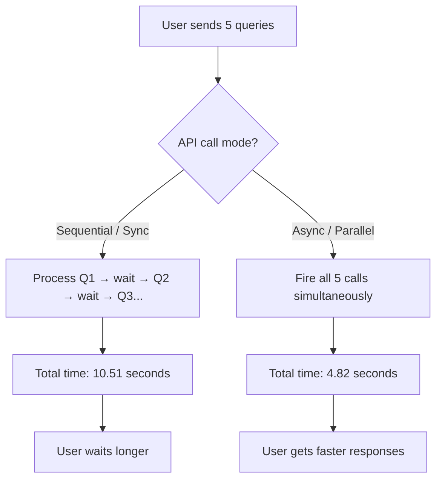
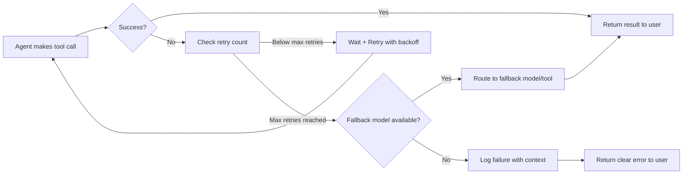
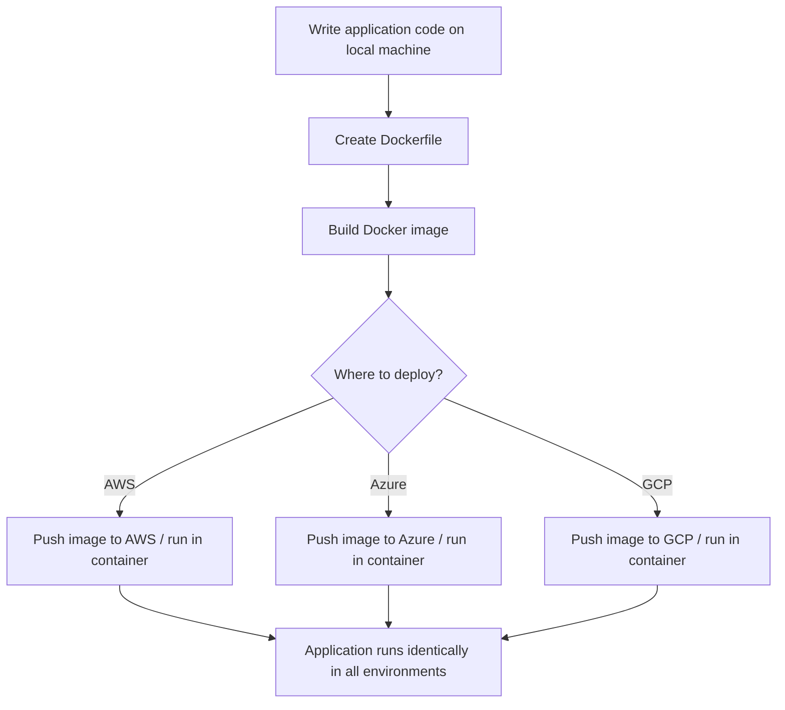

# 73. Rapid Prototyping - Suman - 5 May 2026

# Rapid Prototyping with LLM APIs

### Colab File: [Click Here](https://drive.google.com/file/d/1VVDOFzcecLzdhBhp4c2j4B5E3XA3AUR7/view?usp=sharing)

## What You'll Learn

In this lesson, you'll learn to:

- **Call LLM APIs correctly** — understand the OpenAI-compatible API standard, configure parameters like temperature, max tokens, top K, stop sequences, and choose between streaming and non-streaming responses.
- **Build production-ready chatbots** — set up session state, multi-turn conversation history, tool use for real-time data, and log prompts, responses, latency, and costs.
- **Handle errors and control costs** — implement retry logic with max retry limits, apply rate limits to protect AI budgets, and use async calls to reduce latency by up to 2x.
- **Version and containerize AI applications** — use prompt versioning and A/B testing when model versions change, package applications with Docker and Docker Compose, and deploy with CI/CD pipelines.
- **Scale and recover in production** — configure version rollback, auto scaling, and understand the roles of AWS components like Bedrock, EC2, SageMaker, and API Gateway.

---

## OpenAI and Anthropic APIs — The Industry Standard

> **OpenAI-compatible APIs are the new standard norm for invoking any generative AI model** — whether hosted on AWS, Azure, GCP, or a private cloud.
> 

### Why the Standard Exists

OpenAI-compatible APIs are the standard norm for invoking any generative AI model, whether hosted on AWS, Azure, GCP, or a private cloud. This means: when you deploy a model inside Amazon Bedrock, the endpoint you receive will already be in OpenAI-compatible format. When you self-host on a private cloud like Red Hat OpenShift, you must ensure your model endpoint is also OpenAI-compatible — otherwise no framework can call it.

The two main API families are:

Provider | API Family
OpenAI | Chat completions, completions, embeddings
Anthropic | Messages API (Claude models)

Both use SDK-based calls. The common pattern you have already seen — `LLM.chat_completions`, `LLM.completions` — is the OpenAI-compatible signature.

### Key Parameters You Control

Every LLM API call accepts tuning parameters:

- **temperature** — controls randomness. Low temperature → deterministic, repetitive output. High temperature → creative, varied output.
- **max tokens** — caps the length of the response.
- **top P** — nucleus sampling: the model considers tokens whose cumulative probability reaches P.
- **top K** — the model considers only the top K most probable tokens for each prediction. If top K = 1, the model always picks the single highest-probability word (most deterministic). If top K = 250, it samples from 250 candidates (most diverse). Think of it as how many options the model is allowed to "consider" before choosing the next word.
- **stop sequences** — text patterns that tell the model to stop generating. If you want a list capped at 3 items, set a stop sequence for the 4th item marker — the model stops as soon as it reaches item 4.
- **anthropic version** — version tag for the Anthropic API contract.

### Structured Output

Both OpenAI and Anthropic APIs can return responses in JSON format, which makes programmatic parsing reliable.

---

## Rate Limits and Retry Management

> **Think of your AI budget like a mobile data plan.** If one team member downloads videos all day, everyone else on the same plan runs out of data. Rate limits are the fair-usage policy that protects the shared budget.
> 

### Why Rate Limits Matter

In any AI project, a manager is given a monthly budget — say 10,000or10,000 or 10,000or20,000 — for the whole team's LLM API usage. Without rate limits, a single developer making unoptimized calls can exhaust that budget, leaving nothing for critical work.

Rate limits apply in two directions:

**1. Developer-side:** An administrator assigns each developer or team a maximum number of LLM calls — say 10 or 20 per task. This prevents wasteful or exploratory usage from consuming the project budget.

**2. User-side:** A deployed chatbot must limit how many queries a single user can make in a session. ChatGPT itself does this — you have seen the message "Your limits will be resetting in two hours." You must implement the same protection so users don't inadvertently spike your application bill.

### Max Retries

In an agentic workflow, the agent calls LLMs and external tools to fulfill a user request. If an API call fails (network block, incorrect parameters, tool is broken), the agent will keep retrying unless you set a limit.

Without a max retry limit: the agent enters an infinite loop, never progressing, consuming resources endlessly.

With a max retry limit: after the configured number of attempts, the agent either tries an alternative path or returns a clear error to the user.

**The rule:** always configure `max_retries` on every LLM and tool call in an agentic workflow.

---

## Streaming Responses and Async vs Sync APIs

### The Difference

```
┌─────────────────────────────────────────────────────┐
│ SYNC (blocking)                                      │
│  Request → [wait for full answer] → Full response   │
│                                                      │
│ ASYNC (non-blocking / streaming)                     │
│  Request → word...word...word...sentence...sentence  │
└─────────────────────────────────────────────────────┘

```

In a **sync** call, the server processes the entire query and returns the complete response at once. The client waits, sees nothing, then gets all text together.

In an **async** streaming call, the server sends tokens as it generates them. The client renders each word or sentence as it arrives — which is exactly what you see in ChatGPT.

### Why Streaming Is Better UX

Streaming **reduces perceived latency** without reducing actual compute time. The model still takes the same time to generate the full answer. But the user sees progress immediately, which creates confidence in the application. A 10-second response that starts showing text after 1 second feels much faster than a 10-second blank wait.

Streaming uses **async generators** and an **event stream** pattern. It also handles **partial outputs** — such as broken JSON mid-stream — gracefully.

### How Streaming and Async API Calls Work Together



When you use the `ThreadPoolExecutor` with `max_workers` set to 5, all 5 LLM calls fire simultaneously. In a demo with 5 prompts, async took **4.82 seconds** versus sequential's **10.51 seconds** — a 2x speed improvement. This gap grows as the number of concurrent queries increases, making async calls critical in production.

---

## Rapid Prototyping Components: UI, Session State, and Logging

### The Three Layers of a Rapid Prototype

A rapid prototype is built from three layers working together:

**1. UI Layer (Streamlit or Gradio)**

- Provides `chat input`, `chat messages`, and output display.
- Streamlit runs at port **8501** by default.
- This is where users interact.

**2. Backend + Session State**

- Every conversation in a chatbot exists inside a **session**.
- Within that session, the backend must maintain a **session state** — the full conversation history up to that point.
- Without session state, every message is treated as a fresh start. The model has no memory of what was said before.
- With session state, the model has context and can give coherent, continuing responses.

**3. Logging**

You must log three things for every interaction:

What to Log | Why
Prompts(user inputs) | Enables speculative decoding; reveals common query patterns; helps optimize response time
Responses(model outputs) | Lets you evaluate answer quality and detect hallucinations
Latency | Tracks how quickly your app responds; reveals slowdowns before users notice

Logs must be stored in a database (relational, non-relational, or a graph database) so they can be audited and used to improve the application over time. Without logs, you have no data with which to debug issues.

### Speculative Decoding (Key Interview Topic)

When a chatbot gets repetitive queries — "My credit card was stolen" appears in many forms across thousands of bank users — processing each one through the full RAG flow (vector database → semantic search → retrieval → generation) wastes time.

**Speculative decoding** solves this by having the LLM speculatively predict what the user is asking based on previous cached data. If the prediction matches, the model skips the full pipeline and responds immediately.

Related techniques include **KV caching** and **tensor parallelism** — all are valid answers when an interviewer asks how to reduce chatbot latency.

---

## Error Handling in Agentic Workflows

> **An agent without error handling is like a delivery driver told to "keep trying the same door" when nobody answers — forever.** You need fallback routes.
> 

### What Can Go Wrong

In a normal (non-agentic) workflow, you write human logic: if condition A, hit API X; else hit API Y. You control every branch.

In an agentic workflow, the agent decides which tools to call. If a tool's API is broken, misconfigured, or receives incorrect parameters, the agent does not know to stop. It keeps calling the same broken tool repeatedly.

### The Four Error-Handling Patterns



1. **Proper timeouts:** Set a maximum wait time for any tool or API call. If no response arrives within the timeout, the agent moves on.
2. **Max retries:** Limit the number of retry attempts. In the notebook demo, the agent was set to try 4 times. After 4 failures (simulated error **429** throttling exception), it gracefully moved on without crashing the session.
3. **Fallback models:** If one model or API path fails, have a backup path. Your agentic workflow should never have a single point of failure.
4. **Log failures with context:** Log what failed, why it failed, and when. Without this, debugging a production issue is nearly impossible.

**Result:** with retry logic, the **user never sees the raw error** and the session is not lost. Without it, the app crashes and the user's session is gone.

---

## Prompt Versioning and A/B Testing

> **Prompts are code.** You version code with Git. You version prompts the same way — and for the same reason: so you can go back to what was working.
> 

### Why Version Prompts

In a large AI project, you maintain prompts for multiple products — an auto loan chatbot, a two-wheeler loan chatbot, a personal loan chatbot. Each prompt took significant effort to tune. You would not start from scratch when moving to a new product; you would reference an existing working prompt and adapt it.

When Claude 4.5 was replaced by Claude 4.7, the reasoning model changed. Prompts that worked with 4.5 may be verbose for 4.7. Prompts optimized for 4.7 may be too lean for 4.5. **Prompt versioning** stores both — tagged as **V1**, **V2** — so you can switch back or compare.

### A/B Testing Prompts

After versioning, you **A/B test** the old prompt against the new one:

- If the new prompt produces significantly better results → switch to it.
- If results are similar → keep the old prompt (lower friction, no change needed).

This mirrors the experiment-tracking workflow you saw in **MLflow** and **W&B** for ML model experiments — but applied to prompts.

### What to Track

After each A/B test, measure:

- **Accuracy** — is the answer correct?
- **Faithfulness** — does the answer stick to the source?
- **Latency** — is the new prompt slower or faster?

---

## Docker and Docker Compose for Deployment

### The Problem Docker Solves

You write code on your laptop. It works. You move it to the cloud — and it fails. Why? The cloud uses a different Python version, different library versions, different environment settings.

For a project with hundreds of files, manually resolving every version conflict — especially when you later migrate from AWS to Azure — is not feasible.

**Docker** packages the entire application code, all its dependencies, and all its configuration inside an **image**. When you run that image, it runs inside a **container** — a fully isolated environment that is identical everywhere.

Analogy: Docker is like packing your meal kit — spices, vegetables, utensils — in a sealed tiffin. Wherever you go, you open the tiffin and cook exactly as you planned. The kitchen's equipment does not matter.

### Containerization Workflow



### Docker Compose for Multi-Service Applications

Real AI applications are not single-file programs. They combine multiple services:

- A model service (Amazon Bedrock or SageMaker)
- A compute service (EC2)
- A load balancer (application load balancer)
- A storage service (S3)

**Docker Compose** is a single configuration file that declares all these services and their settings together. You configure it once and deploy everything with one command.

### Secret Management

**Never hardcode API keys in your code.** Always store them in an `.env` file and inject them as **environment variables**. Never commit the `.env` file to Git.

Why this matters: when early AI tools launched, developers hardcoded OpenAI API keys directly in code and pushed to GitHub. Thousands of people used those leaked keys. At month end, the developer received bills in the thousands of dollars. Git now has a credential-detection mechanism that blocks most such commits — but manual review is always safer.

**Rule:** API keys are currency. Treat them like cash.

---

## CI/CD Pipelines and Automated Vector Store Updates

### What CI/CD Does

**CI/CD** (Continuous Integration / Continuous Deployment) is the process where developers continuously make code changes, submit them for review, get them merged, and automatically trigger deployments or pipelines.

For AI applications, the most common pipeline use case is **automated vector store updates**:

A bank's policy documents change frequently — new interest rates, revised circulars. Each change requires:

1. Finding the outdated document in the vector store.
2. Deleting its records.
3. Embedding the new document.
4. Inserting the new records.

Doing this manually for thousands of documents is not feasible. Instead, you build a pipeline that:

1. Monitors an **S3** bucket (or any object storage) where stakeholders upload new PDFs.
2. Runs on a schedule — for example, every night at **9:30**.
3. Detects new or changed documents, deletes old embeddings, and inserts new ones.

This ensures users always receive answers based on the latest information — not outdated policies.

### GitHub Actions for CI/CD

**GitHub Actions** is the recommended tool for CI/CD, especially for demos and smaller projects. For larger industry deployments, more advanced CI/CD tools are used.

---

## Version Rollback and Auto Scaling

### Version Rollback

A senior developer integrates a new agent method into the production chatbot. It passes all testing — stress testing, A/B testing, canary testing. It goes live. It starts **hallucinating** and giving wrong responses.

The fix: **version rollback**. You revert the deployment to yesterday's version, which was working correctly. All the changes from today are erased from production.

This is only possible if you:

- Track every deployment version.
- Have a mechanism to roll back quickly without touching the underlying code.

Version rollback is one of the reasons you use cloud deployment instead of running on local Streamlit.

### Auto Scaling

A bank chatbot sees very different load at different times:

- **Early morning:** few users, low load.
- **Banking hours (10am–3pm):** peak load, many simultaneous queries.

**Auto scaling** means the application intelligently adjusts its capacity based on current load:

- **Scale up** when load is high → serve more users simultaneously.
- **Scale down** when load is low → reduce resource usage, save costs.

Without auto scaling, you would need to provision for peak load at all times — wasting resources during quiet hours.

---

## AWS Components Architecture

This is a mapping of standard AI deployment roles to specific AWS services. The concepts are cloud-agnostic; the service names vary by provider.

Role | AWS Service | Purpose
Virtual machines | EC2 | General-purpose compute instances
Serverless containers | AWS Fargate | Run containers without managing servers
Load distribution | Application Load Balancer | Route traffic across multiple instances
API management | API Gateway | Networking, security, rate limiting at the entry point
LLM access | Amazon Bedrock | Access LLMs (including Claude Sonnet) as a serverless API, charged per query
ML development | SageMaker | Full ML studio with a JupyterLab-like console for developing ML and data science code
Container orchestration | EKS | Managed Kubernetes for large-scale deployments

**Bedrock** is the primary service for generative AI. It gives you LLMs without managing any infrastructure — you just connect via **Boto3** (the Python connector between your local machine and AWS) and make API calls.

---

## LLM API Notebook: Credentials, System Prompts, and Parameters

### Credential Setup with Boto3

To connect to Bedrock from your local machine:

```bash
aws configure

```

This prompts you for your AWS credentials (username, password). Once configured, Boto3 reads them automatically. Alternatively, you can pass credentials explicitly via the Boto3 session object:

```python
session = boto3.Session(profile_name='default', region_name='us-east-1')
client = session.client('bedrock-runtime')

```

The model ID (for example, Claude Sonnet in Bedrock) is passed as a parameter. The JSON body includes `anthropic_version`, `max_tokens`, `messages` (with role and content), `temperature`, `top_p`, `top_k`, and `stop_sequences`.

### System Prompts in Action

Without a system prompt, asking "explain recursion" returns a generic answer. With a system prompt that defines a persona — elementary school teacher, stand-up comedian, corporate lawyer — the model tailors its answer to that persona. This is essential in production chatbots to ensure the model behaves appropriately for its audience.

### Top K Parameter — Live Demo

The notebook demonstrated top K at three values:

Top K | Effect
1 | Always picks the single highest-probability token → very repetitive, deterministic output
10 | Samples from 10 candidates → some variation
250 | Samples from 250 candidates → highly diverse, creative output

Top K and temperature work similarly: low values → repetitive; high values → diverse. Top K is more aggressive because it completely eliminates low-probability tokens from consideration.

### Stop Sequences in Action

Without stop sequences: "list 10 programming languages" returns all 10.

With a stop sequence set to the 4th item marker: the model stops after completing item 3, regardless of what the user asked for. This is used to control output length in structured generation tasks.

---

## Multi-Turn Conversation History

> **Without memory, every message is a conversation with a stranger who has never met you before.** With conversation history, you get a consistent, context-aware assistant.
> 

### The Problem

If you call the LLM API twice in separate calls:

- Call 1: "My name is Alice and I love astronomy."
- Call 2: "What is my name and what do I love?"

Call 2 has no connection to Call 1. The model responds: "I don't have any information about you personally."

### The Fix: Multi-Turn History

Maintain a `messages` list that accumulates the conversation:

```python
messages = [
    {"role": "user",      "content": "My name is Alice and I love astronomy."},
    {"role": "assistant", "content": "That's great! Astronomy is a fascinating field."},
    {"role": "user",      "content": "What is my name and what do I love?"}
]

```

When you pass this full list to the API, the model sees the prior context and correctly answers: "Your name is Alice and you love astronomy."

**Key rule:** in any production generative AI application, you must store and pass conversation history. A stateless chatbot will frustrate users. The techniques for managing memory in large conversations are more advanced than this basic pattern — but this is the foundation.

---

## Tool Use for Real-Time Data Access

LLMs are not trained on real-time data. Ask an LLM for NVIDIA's current stock price and it responds: "I don't have access to real-time data."

**Tool use** solves this by giving the LLM access to Python functions that can fetch live data:

```python
def get_stock_price(ticker):
    # Uses Yahoo Finance to fetch live price
    ...

```

When the user asks for NVIDIA's stock price:

1. The LLM recognizes it cannot answer from training data.
2. It identifies `get_stock_price` as an appropriate tool.
3. It calls the Python function.
4. It receives the live price from **Yahoo Finance**.
5. It returns a complete, accurate answer.

This is the foundation of agentic workflows — the LLM acts as a reasoning layer that decides which tools to call, calls them, and synthesizes the results.

---

## Frequency Penalty, Presence Penalty, and Repetition Penalty

These three parameters control how the model treats words it has already generated:

Parameter | Behavior | Available In
Frequency penalty | Penalizes tokens in proportion to how often they have appeared. If "Varun" appears 5 times, the model is less likely to say "Varun" again. Reduces repetition. | OpenAI API
Presence penalty | Penalizes any token that has appeared at all, regardless of frequency. Encourages topic diversity — moves the conversation away from topics already covered. | OpenAI API
Repetition penalty | Similar to frequency penalty; discourages repetitive token generation. | Llama and similar models

**Practical use:** instead of using these as raw parameters, you can embed the same instruction in a system prompt: "Each bullet point must use completely different words and cover a distinct benefit, no repeated words." The notebook demonstrated that this system prompt approach produces diverse marketing bullet points for a fitness app, while without it the model repeats similar ideas.

---

## Cost Tracking and Logging

### Why You Need Cost Tracking

Every LLM API call consumes tokens and costs money. Cost is calculated as:

```
cost = (input_tokens × price_per_input_token + output_tokens × price_per_output_token) / 1000000

```

All cloud providers charge **per million tokens**. Without cost tracking:

- You cannot tell which queries are expensive.
- You cannot tell if your application is running over budget.
- You have no data to optimize.

### What to Log per API Call

For every LLM call, log:

- **Input tokens** consumed
- **Output tokens** generated
- **Latency** (response time)
- **Dollar cost** of that call

Store these logs in a database. In AWS, **CloudWatch** handles logging automatically for deployed applications. The notebook showed a Python function `calculate_cost` that computes cost from token counts — in production, this is provided directly by cloud providers.

### The Value of Prompt Logs

Logged prompts reveal:

- Which questions users ask most (candidates for speculative decoding or caching).
- Which prompts produce the slowest responses (targets for optimization).
- Which prompts produce poor-quality answers (targets for prompt engineering improvement).

Without logs, you are flying blind.

---

## Key Takeaways

- **OpenAI-compatible API is the industry standard** — every LLM deployment uses it, and every parameter (temperature, top K, stop sequences, max tokens) controls a specific aspect of generation behavior.
- **Rate limits and retries protect budgets and keep agentic workflows stable** — without them, a single runaway process can exhaust a project's entire AI budget or loop forever on a broken tool.
- **Streaming reduces perceived latency; async calls reduce actual wall-clock time** — in a demo, async cut 5 simultaneous API calls from 10.51 seconds to 4.82 seconds.
- **Prompt versioning, Docker, and CI/CD are production necessities, not optional** — deploying a chatbot inside local Streamlit is not the same as deploying it on a cloud with version control, containerization, auto scaling, and rollback capability.
- **Think of yourself as an AI engineer, not just a model developer** — companies expect you to understand cloud deployment, load balancing, API gateways, cost tracking, and system design. This is what separates candidates in interviews.
- **API keys are currency** — store them in `.env` files, never hardcode them, and rotate them if shared. Leaking API keys can result in bills of $18,000 or more for a month of someone else's usage.

            .markdown-preview table, 
            .markdown-preview th, 
            .markdown-preview td {
              background-color: white !important;
              color: black !important;
            }
            .markdown-preview pre, 
            .markdown-preview code {
              background-color: inherit !important;
              color: inherit !important;
              box-shadow: 0 2px 4px rgba(0, 0, 0, 0.1);
            }