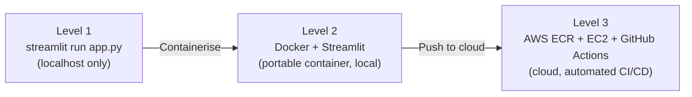
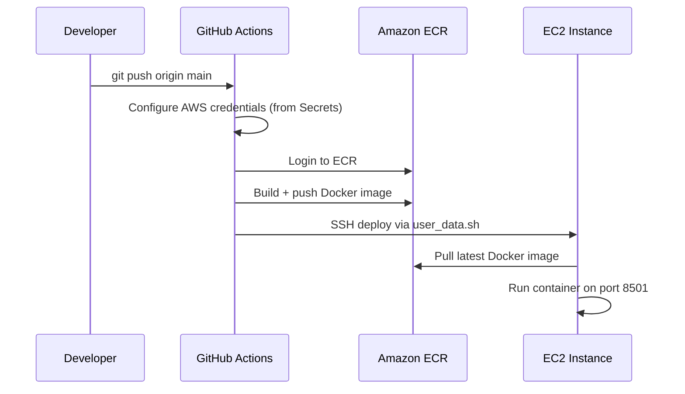

# 74. Deploying Streamlit - Suman - 7 May 2026

# Deploying Streamlit — From Local to AWS EC2 with Docker and CI/CD

### Github Folder: [Click Here](https://github.com/varunchach/RAG_at_scale)

## 1. What You'll Learn in This Section

In this lesson, you'll learn to:

- Explain the three deployment maturity levels — local Streamlit, Dockerised container, and cloud-hosted on AWS EC2.
- Build a Docker image for a Streamlit app, run it with Docker Compose, and push it to Amazon ECR.
- Configure a GitHub Actions CI/CD pipeline that deploys your app to EC2 automatically on every code push.
- Identify the key Amazon Bedrock features — model catalogue, Playground, guardrails, prompt management, and inference profiles — and explain when to use each.

---

## 2. Detailed Explanation

### Amazon Bedrock — the model library behind the app

**Amazon Bedrock** is Amazon's serverless platform for accessing large language models (LLMs). You call an API, you pay per call, and Amazon handles all the infrastructure. You never manage a server to get model access.

Think of Bedrock as a premium subscription service. Unlike Hugging Face — an open community repository where anyone uploads models — Bedrock gives you enterprise access to proprietary models (like Anthropic's Claude family) and open-source models (like Meta's Llama family). It also includes production tooling built around them.

### What's inside the Bedrock console

The Bedrock console organises several features:

**Model catalogue** — lists every available model by provider. Models accept different input modalities: text, image, video, and audio. You browse the catalogue to pick the right model for your use case before writing any code.

**Playground** — an interactive scratchpad. You send a prompt to one model, or compare two models side by side in real time. When you run the same question through two 8-billion-parameter models simultaneously, you see their latency and token counts side by side. This is exactly the kind of model-selection comparison you would do before committing to one for a project. Think of it like a comparison page on an e-commerce site, but for LLMs.

**Tokeniser tool** — shows you how a model splits text into tokens. Type "unhappy" and the tool returns 10 tokens for just 7 characters. That result illustrates the core point: a **token** is a subword unit, not a character and not a word. The rule of thumb is that one token equals roughly three-fourths of a word (0.75), meaning one word is approximately 1.33 tokens. Token count drives your API cost, so understanding tokenisation helps you estimate and control spend.

**Evaluation framework** — lets you score your chatbot's output either programmatically (based on task type) or with **LLM-as-Judge**. In the LLM-as-Judge approach, a second independent LLM (such as Llama 70B) assesses each response from your primary chatbot. It scores on metrics including coherence, faithfulness, relevance, completeness, readability, professional style, and instruction-following.

**Prompt Management** — a console for creating, testing, saving, and versioning prompts. Once you save a prompt (for example, a summarisation instruction), Bedrock assigns it an ARN. Your application loads the prompt via that ARN rather than hardcoding the text in code. Switching between tested versions — V1, V2, and so on — becomes a one-line change.

**Prompt versioning** is the practice of saving each tested prompt configuration as a named version. This lets an entire team reference the same prompt consistently, without re-writing it in every file.

**Guardrails** — a configurable filter that sits in front of both inputs and outputs. It can block:

- Harmful categories (hate speech, violence, prompt injection attacks)
- Off-topic queries (a sports chatbot refusing to answer Python questions)
- Profanity and custom denied topics
- PII — built-in types like email, name, and password, plus custom RegEx patterns (for example, a 12-digit Aadhaar card number pattern to prevent that data from appearing in responses)
- Factual grounding (factual accuracy checks)

**Inference profiles** — a configuration layer that routes model API calls across regions and manages throughput. You can call a foundation model directly by its model ID, but an inference profile adds cross-region failover, higher throughput quotas, and runtime parameters such as KV caching and tensor parallelism. Think of a foundation model as a car engine: functional on its own, but an inference profile is the full drivetrain — it puts the engine to work reliably at scale.

---

### Rapid prototyping patterns

Before deploying any app, you typically experiment in a notebook. Three patterns matter most.

### Async vs. sequential calling

**Sequential calling** makes API requests one at a time. Each call must finish before the next begins. Running 5 questions sequentially takes approximately 17 seconds.

**Async calling** fires all requests in parallel using `ThreadPoolExecutor`. The same 5 questions completed in 6.81 seconds — approximately 2.5× faster.

Here's the async pattern with 5 worker threads:

```python
from concurrent.futures import ThreadPoolExecutor

with ThreadPoolExecutor(max_workers=5) as executor:
    results = list(executor.map(call_bedrock, questions))

```

Use async whenever your app needs to handle multiple user requests without blocking. Sequential is fine for one-at-a-time notebook exploration.

### Exponential back-off retry

APIs occasionally return transient errors — network blips, rate-limit spikes. Without a retry layer, those errors crash the user's session.

**Exponential back-off retry** catches the error, sleeps briefly, and tries again — up to a fixed limit (4 retries). The user sees nothing; the session survives.

```python
max_retries = 4
for attempt in range(max_retries):
    try:
        result = call_function()
        break
    except Exception as e:
        time.sleep(...)  # sleep grows with each attempt

```

### Cost tracking

Every LLM call produces measurable output: input tokens, output tokens, latency, and cost. A cost-tracking function captures all four per query and accumulates totals across a session. For example, 2 calls can cost approximately $0.00880 in total.

### Prompt versioning in code

Instead of hardcoding a prompt string, load a saved version by name:

```python
prompt = load_prompt("v1")
output_text_v1 = generate(prompt, article_text)

```

Passing the raw string directly produces incorrect output; loading from V1 produces the correct result. This reinforces why prompt management matters at scale.

---

### The three deployment levels

Every Streamlit-based AI app passes through (or can pass through) three deployment stages. Each stage solves a progressively larger problem.



**Level 1 — plain Streamlit, local only.** Activate your virtual environment and run:

```bash
streamlit run app.py

```

The app opens at `localhost:8501`. Only you can access it. If it works on your laptop but not a colleague's, the most likely cause is a missing dependency or environment mismatch.

**Level 2 — Docker + Streamlit, containerised but still local.** A **Dockerfile** captures every dependency and configuration step. Once built, the image runs identically on any Docker-enabled machine — solving the "works on my machine" problem.

The Dockerfile for this project follows this structure:

```docker
FROM python:3.11
WORKDIR /app
COPY requirements.txt .
RUN pip install -r requirements.txt
COPY . .
EXPOSE 8501
HEALTHCHECK ...
CMD ["streamlit", "run", "app.py", "--server.address=0.0.0.0"]

```

Key lines explained:

- `FROM python:3.11` — sets the base environment.
- `EXPOSE 8501` — documents the port Streamlit listens on (metadata only; the port is actually published via the `-p` flag at `docker run` time or in `docker-compose.yml`).
- `CMD` — the startup command Docker runs automatically.

**Docker Compose** orchestrates building and running the container:

```bash
docker compose build   # build the image
docker compose up      # start the container on localhost:8501
docker compose down    # stop and remove the container

```

A **Docker image** is the static, portable snapshot. A **Docker container** is a live running instance of that image. Stopping a container on one machine does not affect images or containers on any other machine.

**Level 3 — Cloud, Docker, Streamlit, ECR, EC2, CI/CD.** The containerised image moves from your laptop to the cloud. Two AWS services handle the transition:

- **Amazon ECR (Elastic Container Registry)** stores your Docker image in a private cloud registry. It's the AWS equivalent of Docker Hub.
- **Amazon EC2 (Elastic Compute Cloud)** is the cloud virtual machine that pulls your image from ECR and runs it — scalable to serve thousands of users.

---

### Pushing to ECR and provisioning EC2

Create the ECR repository with the AWS CLI:

```bash
aws ecr create-repository \
  --repository-name bedrock-chatbot-one \
  --region us-east-1

```

The command returns a JSON response confirming the repository details.

Once your EC2 instance is provisioned, retrieve its public IP:

```bash
aws ec2 describe-instances --instance-ids <INSTANCE_ID> \
  --query 'Reservations[0].Instances[0].PublicIpAddress'

```

This IP (for example `54.164.162.182`) is the address anyone uses to reach your app in a browser.

---

### GitHub Actions CI/CD pipeline

**CI/CD (Continuous Integration / Continuous Deployment)** automates the build-and-deploy chain. Every time you push code, the pipeline rebuilds the image, pushes it to ECR, and redeploys to EC2 — with no manual steps.

**GitHub Actions** runs this automation via a YAML workflow file at `.github/workflows/deploy.yml`:

```yaml
name: Trigger Deploy
on:
  push:
    branches: [main]
jobs:
  deploy:
    steps:
      - name: Configure AWS credentials
        ...
      - name: Login to ECR
        ...
      - name: Build and push image to ECR
        ...
      - name: Deploy to EC2 via SSH
        ...

```

The workflow triggers on every push to `main`. It reads credentials from **GitHub Secrets** — encrypted key-value pairs stored in the repository. Secrets used here include AWS access keys, the SSH key, the EC2 host IP, and the ECR registry URL.

The `user_data.sh` script on the EC2 instance encapsulates all environment setup: logging into ECR, pulling the updated Docker image, and starting the container.

One practical detail: EC2 public IPs can change. Whenever the EC2 instance restarts and gets a new IP, update the `HOST` GitHub Secret to match. The workflow reads `HOST` to know where to SSH for deployment.

Here is the deployment sequence end to end:



---

### The Streamlit app itself

The chatbot UI is built with **Streamlit** — a Python library for browser-based AI and data apps. Running `streamlit run app.py` starts the app at `localhost:8501`. The UI includes:

- A **temperature slider** to control response creativity.
- A **streaming toggle** — with streaming on, tokens appear one by one. With streaming off, a spinner shows while the model computes, then the full answer appears.
- A **session log panel** tracking total calls, total cost, and average latency.

The response dispatch logic looks like this:

```python
if use_streaming:
    response = stream_response(user_question, system_prompt, temperature)
else:
    with st.spinner("Thinking..."):
        response = invoke_model(user_question, system_prompt, temperature)

```

The app sets a `max_tokens` of 512 for LLM responses, which bounds both latency and cost per call.

---

### Application folder structure for production

A production-style project separates concerns across folders:

Folder / File | Purpose
app/ | Modular Python source files (one file per component)
notebooks/ | Experimental / prototyping notebooks
.github/ | GitHub Actions workflow (deploy.yml)
docker-compose.yml | Build and run configuration
user_data.sh | EC2 setup and image-pull script
.env | Local environment variables (never committed)
.gitignore | Excludes secrets and virtual environments from version control

Modular `.py` files are preferred over a single giant script. Each component can be tested independently, and the team can update one module without touching the rest.

---

## 3. Key Takeaways

- **Three maturity levels, one progression.** Local → Docker → EC2 + ECR + GitHub Actions. Docker fixes environment mismatches; EC2 makes the app public; GitHub Actions removes manual deploys.
- **Docker = portable environment.** A Dockerfile captures Python version, dependencies, port, and startup command. Build once; the image runs identically everywhere.
- **ECR is Docker Hub for AWS.** Push your image to ECR via the AWS CLI; EC2 pulls it via `user_data.sh`. When the EC2 IP changes, update the `HOST` Secret.
- **GitHub Actions closes the loop.** A push to `main` triggers credentials → ECR login → image build and push → SSH deploy to EC2. No manual steps needed.
- **Inference profiles add scale to a foundation model.** A foundation model can be called directly by its model ID, but an inference profile layers on cross-region failover, higher throughput quotas, and runtime parameters (KV caching, tensor parallelism) for production workloads.

These deployment and model-serving patterns form the foundation for building production-grade cloud architectures. The same ECR + EC2 + GitHub Actions structure scales to multi-service systems and more advanced AWS cloud configurations.

            .markdown-preview table, 
            .markdown-preview th, 
            .markdown-preview td {
              background-color: white !important;
              color: black !important;
            }
            .markdown-preview pre, 
            .markdown-preview code {
              background-color: inherit !important;
              color: inherit !important;
              box-shadow: 0 2px 4px rgba(0, 0, 0, 0.1);
            }