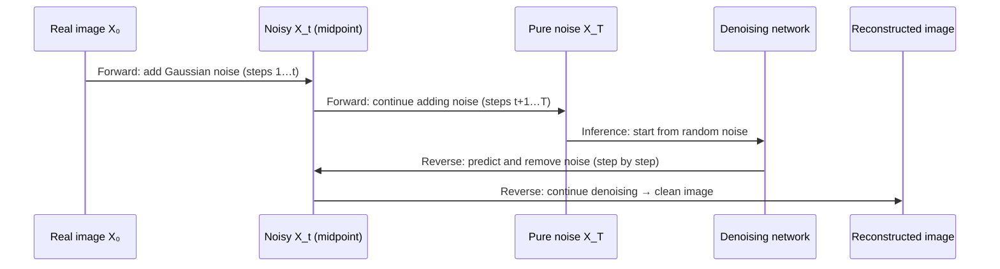

# 89. Generative Models 101 - Suman - 3 Jun 2026

# Generative Models 101: VAE, GAN, and Diffusion

## PPT File: [Click Here](https://coding-platform.s3.amazonaws.com/dev/lms/tickets/dfaf5d73-2fb6-4127-ac9b-e52a738fd572/AUJ0EcrOxDFyMvUL.pdf)

## 1. What You'll Learn in This Section

In this lesson, you'll learn to:

- Distinguish generative models from discriminative models and explain why learning P(X) — not P(Y|X) — is the key difference
- Trace how each architecture (VAE, GAN, Diffusion) transforms random noise into a realistic output
- Identify the training mechanism, key loss functions, and inference procedure for VAE, GAN, and Diffusion Models
- Compare the three architectures on quality, diversity, and stability — and explain where each one excels

## 2. Detailed Explanation

### Generative vs. Discriminative Models

Most models you encounter early in machine learning are **discriminative models** — they learn to map an input to a label. A CNN that looks at a photo and outputs "car", "truck", or "scooter" is discriminative. Formally, a discriminative model learns the conditional probability **P(Y | X)**: given input X, what is the probability of label Y? Other examples include SVMs, random forests, decision trees, and logistic regression.

**Generative models** solve a different problem entirely. Instead of predicting a label, they learn the probability distribution **P(X)** of the input data itself — essentially modelling the data-generating process. Once trained, they can draw brand-new samples from that learned distribution. The output is a new data sample (an image, a line of text, an audio clip) rather than a class label.

In conditional generative models, the model learns the joint distribution **P(X, Y)** so that generation can be steered with a class label or a text prompt. The basic (unconditional) form works purely on P(X).

```
Discriminative model(learns P(Y|X))Generative model(learns P(X))Conditional generative model(learns P(X,Y))Input XLabel YRandom noise ZNew data sampleRandom noise Z + labelClass-guided sample
```

### Learning the Data Distribution — and Why It's Hard

Every generative model shares one core training goal: learn the probability distribution P(X) of the training data well enough to sample new, convincing examples from it.

A probability distribution is pinned down by its **parameters**. For a Gaussian distribution those are the mean (μ) and standard deviation (σ). **Maximum Likelihood Estimation (MLE)** finds the parameter values (θ*) that best explain the observed training data. Formally, it asks: "which parameter values make the training samples most likely?"

Two practical challenges make this hard:

- **High-dimensional data** — a single image can have thousands or millions of pixel dimensions, making the parameter space enormous.
- **Intractable likelihood estimation** — for complex real-world data, computing the parameters directly may be mathematically infeasible, so models use approximations or learned representations instead.

VAE, GAN, and Diffusion each take a different approach to working around these challenges.

### Variational Autoencoder (VAE)

A **VAE** (Variational Autoencoder) solves the generation problem by learning a compact, probabilistic summary of the data in a **latent space**, then learning to reconstruct full outputs from that summary.

**Three components work in sequence:**

Component | Role
Encoder | Compresses a high-dimensional input (e.g., an image) into a probability distribution in the latent space — outputting a mean vector μ and variance vector σ²
Latent space | A compact, probabilistic space where every training sample is represented as a distribution centred on its learned μ with spread σ
Decoder | Samples a point Z from the latent distribution and reconstructs the full-dimensional output from it

**Inside the encoder.** The encoder's hidden layers work like a standard neural network — weighted aggregation of inputs followed by an activation function. The final hidden representation H is:

```
H = f(W · X + b)

```

From H, two output heads run in parallel:

- The **mean head** outputs μ — one value per latent dimension
- The **variance head** outputs log(σ²) — one value per latent dimension

For a two-dimensional latent space, the encoder produces μ = [μ₁, μ₂] and σ = [σ₁, σ₂].

**The reparameterization trick.** Training requires gradients to flow backward from the decoder through the sampling step and into the encoder. But sampling is a stochastic operation — it breaks the gradient graph. The reparameterization trick solves this by rewriting the sample Z as:

```
Z = μ + σ · ε,   where  ε ~ N(0, 1)

```

ε is drawn from a standard normal distribution and treated as a fixed noise input, not a learnable node. This moves the randomness outside the computational graph so gradients flow through μ and σ unobstructed. Without this trick, end-to-end training is impossible.

**Watch out for:** if you skip the reparameterization trick and sample Z directly, backpropagation breaks at the sampling step — the encoder receives no gradient signal and never improves.

**Two training losses** work together:

- **Reconstruction loss** — measures how closely the decoder's output I′ matches the original input I. Minimising this pushes the encoder and decoder to preserve information through the latent space.
- **KL divergence loss** — penalises the learned latent distribution for deviating from a standard normal N(0, 1). Without this regularisation, the latent space develops arbitrary gaps and the decoder cannot generate from random samples.

**Seeing it on MNIST.** Train a VAE on hand-written digit images using a two-dimensional latent space (two dimensions are chosen here because they can be plotted directly; real applications use more). Each digit image is mapped to a point in the 2D plane defined by its μ = [μ₁, μ₂]. After training, the latent space self-organises into clusters: images of "8" group near one region, images of "3" near another, images of "6" near another. Sampling any point in those regions and passing it to the decoder yields a recognisable digit of the corresponding class.

**VAE vs. regular autoencoder.** A regular autoencoder compresses an input to a single fixed vector Z and reconstructs from it — deterministic throughout. A VAE replaces that fixed vector with a distribution (μ, σ) and samples Z using the reparameterization trick. This probabilistic latent space enables smooth interpolation and varied sample generation. Encode a black dog through a regular autoencoder and you get the same black dog back. Encode it through a VAE and the output may show a dog with a slightly different colour or shape, because Z is sampled from a distribution rather than fixed.

**Inference — no encoder needed.** Once training is complete, the encoder is discarded. To generate a new image: sample a latent vector Z from the learned latent space (or from a standard normal), pass Z to the decoder, and receive a new image. In an unconditional VAE the specific digit or class is not controllable — the output depends on where in the latent space Z lands.

### Generative Adversarial Network (GAN)

A **GAN** (Generative Adversarial Network) takes a completely different approach: instead of an encoder–decoder pipeline, it pits two networks against each other in a training competition.

**The two players:**

Network | Input | Output | Goal
Generator G | Random noise vector Z | Synthetic image G(Z) | Fool the discriminator
Discriminator D | Real image X or synthetic G(Z) | Probability in [0, 1] that the image is real | Catch fakes

D(X) = 1 means the image is judged real; D(X) = 0 means judged fake. The word *adversarial* captures the relationship: the generator tries to fool the discriminator, and the discriminator tries not to be fooled.

**The latent vector Z is a feature vector.** Each dimension of Z corresponds to some learned feature of the output. For face generation, one dimension might encode hair colour: incrementally increasing that value shifts the generated face from brown hair to black. The network learns these correspondences on its own — a designer explores them by varying one dimension at a time while holding the rest fixed.

**The loss function.** Both objectives share a single unified expression:

```
V(D, G) = E[log D(X)] + E[log(1 − D(G(Z)))]

```

- The **discriminator** maximises V — it wants D(X) → 1 (real images recognised) and D(G(Z)) → 0 (fakes caught).
- The **generator** minimises V — it wants D(G(Z)) → 1 (fakes mistaken for real). Using `1 − D(G(Z))` in the shared expression lets D maximise and G minimise the same objective.

**Training alternates** — the two networks are never updated at the same time:

1. **Discriminator update (generator frozen):** sample M fake images from G and M real images from the data; apply **gradient ascent** to maximise V with respect to D.
2. **Generator update (discriminator frozen):** sample M fake images; apply **gradient descent** to minimise V with respect to G.

Each epoch brings both networks closer to the ideal trained state.

**When to stop — Nash equilibrium.** Training targets the point where neither player can improve any further, called **Nash equilibrium**. At this point the generator is producing images realistic enough to confuse the discriminator, and the discriminator outputs D(G(Z)) ≈ 0.5 — complete uncertainty between real and fake. The stopping criterion is D(G(Z)) ≈ 0.5. A value near 1 means the discriminator is being fooled (generator too dominant); near 0 means the fakes are obviously wrong (generator too weak).

**Inference.** The discriminator is discarded after training. Supply a random noise vector Z to the generator and it produces a new image.

**Watch out for:** the adversarial setup makes GAN training unstable. If one network advances too far ahead of the other, the feedback breaks down. The generator may collapse to producing one repeated output (**mode collapse**), or the discriminator may become so powerful that the generator receives no useful gradient. This is the main reason GANs score low on training stability compared to VAE and Diffusion.

### Diffusion Models

**Diffusion models** take yet another approach: rather than encoding data or competing networks, they learn to **undo controlled destruction**.

**Two processes define the framework:**

The **forward process (noising)** takes a real image X₀ and adds small amounts of Gaussian noise at each step, producing X₁, X₂, …, X_T. By step T, the image is indistinguishable from pure random noise — it resembles a sample from N(0, 1).

The **reverse process (denoising)** trains a neural network to predict and remove the noise added at each step, working backwards from X_T to recover X₀. The training objective at each step is to predict the noise ε that was added, and the loss measures how accurately the model predicts ε from the noisy image X_T.



**At inference**, no real image is needed. Start from a random noise sample (acting as X_T), apply the learned denoising steps iteratively, and a realistic image emerges step by step.

**Popular implementations.** Stable Diffusion and DALL-E are deployed systems built on diffusion model principles. Both support text-to-image generation: supply a text prompt, and the model generates a high-quality matching image. This text-conditioning is a feature of advanced conditional diffusion models, not the basic unconditional form.

All three architectures start inference from random noise but transform it differently. The VAE samples Z from the latent space and passes it to the decoder. The GAN feeds Z directly to the generator. Diffusion starts from a pure-noise image X_T and iteratively denoises it.

### Comparing the Three Architectures

Property | VAE | GAN | Diffusion
Training stability | High | Low | High
Output diversity | Medium | High | High
Output quality | Moderate | High | Very high
Training speed | Moderate | Moderate | Slow (high infrastructure)
Key mechanism | Probabilistic latent space + KL regularisation | Adversarial generator–discriminator competition | Iterative denoising of a noise-corrupted image

Diffusion models are currently the state of the art for high-quality image generation. GANs produce high diversity but suffer from instability. VAEs are stable and produce good diversity but moderate quality.

**A concrete example — "Generate a red sports car parked on a beach at sunset":**

- A **GAN** produces a good-quality image that captures many elements of the prompt but may miss some details.
- A **VAE** produces a recognisable car but with less fine detail and clarity.
- A **Diffusion model** produces a high-quality, realistic image that matches all aspects of the prompt: correct colour, setting, lighting, and detail.

This is why diffusion models have become the preferred choice for high-fidelity, semantically precise image generation.

### Basic vs. Conditional Generation

In a **basic (unconditional) generative model**, the model samples from its learned distribution freely — the specific class or content of the output cannot be directed. A basic VAE trained on digits might generate a 3, a 7, or an 8 depending on where the sampled Z lands in the latent space.

In a **conditional generative model**, the model is trained with class labels (or text prompts) so the user can specify what to generate. A conditional diffusion model accepts a text prompt and generates an image matching that description. DALL-E and Stable Diffusion are conditional diffusion models; their text-steering capability is what makes them so powerful in practice.

### Large Language Models as Generative Models

**Large Language Models (LLMs)** belong to the same family as VAE, GAN, and Diffusion. They are **autoregressive** generators: each token is produced one at a time, conditioned on all previously generated tokens. The underlying principle is identical — learn a distribution over training data (text, in this case) and sample from it. LLMs generate text; they do not natively generate images unless combined with a separate vision-generation component.

### Generative AI in Fashion

Diffusion models see heavy real-world use in the fashion industry. A standard pipeline for fashion image generation runs through five steps:

1. **Dataset** — curated fashion images representing the target style, garment type, or design vocabulary.
2. **Preprocessing** — image normalisation, augmentation, and formatting.
3. **Model training** — train a diffusion model on the prepared dataset.
4. **Generation** — provide a noise input (and optionally a text prompt) to produce new fashion images.
5. **Evaluation** — assess generated image quality and diversity using quantitative metrics.

Applications include generating personalised clothing designs, building virtual try-on systems, and creating 3D garments for digital fashion and e-commerce. Diffusion models are preferred here because their high output quality and diversity are exactly the qualities that matter when producing innovative, commercially viable designs.

## 3. Key Takeaways

- A generative model learns the probability distribution P(X) of its training data to sample brand-new examples. This shift from predicting labels to producing new data samples defines the generative family.
- The VAE encodes inputs as distributions in a latent space (not fixed vectors). It uses the reparameterization trick to keep gradients flowing and combines reconstruction loss with KL divergence loss to build a smooth, useful latent space.
- The GAN trains a generator and discriminator against each other using a min-max loss with alternating gradient updates. Training targets Nash equilibrium (D(G(Z)) ≈ 0.5); only the generator is kept at inference.
- Diffusion models learn to reverse controlled destruction. During training the network predicts the noise ε added at each step; at inference it denoises a random noise sample step by step into a realistic image.
- Diffusion models offer the highest output quality (Stable Diffusion, DALL-E). GANs offer high diversity but unstable training. VAEs offer stable training with moderate output quality.

**Mental model:** Think of generative models as three different kinds of artists learning from a gallery of paintings. The VAE artist studies each painting, compresses it into a personal "style note" (the latent distribution), and paints new pieces by sampling from those notes. The GAN artist improves by playing a continuous game with a harsh critic — every brushstroke is judged, and both artist and critic get better. The Diffusion artist learns by watching paintings slowly dissolve into static, then mastering the skill of reversing that dissolution — starting from noise and patiently revealing the picture.

            .markdown-preview table, 
            .markdown-preview th, 
            .markdown-preview td {
              background-color: white !important;
              color: black !important;
            }
            .markdown-preview pre, 
            .markdown-preview code {
              background-color: inherit !important;
              color: inherit !important;
              box-shadow: 0 2px 4px rgba(0, 0, 0, 0.1);
            }